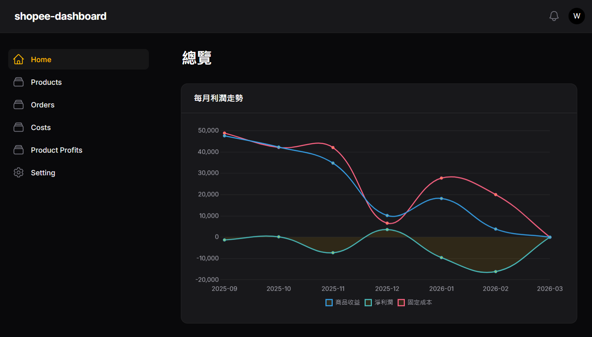

# Shopee Dashboard 賣場營運管理系統

這是一個基於 **Laravel 12** 與 **Filament PHP v5** 開發的 Shopee 賣家數據管理後台，旨在協助賣家更精確地追蹤訂單、計算產品利潤、管理營運成本並可視化經營成效。



## 🚀 核心功能

- **營運儀表板 (Dashboard)**：整合 `ProfitsChart` 統計圖表，即時掌握利潤走勢。
- **訂單自動化 (Order Management)**：
  - 支援訂單資料批次匯入 (`OrderImporter`)。
  - 完整紀錄訂單狀態 (`OrderStatus`)、支付方式 (`OrderPayment`) 與物流方式 (`OrderShipping`)。
- **產品管理 (Product Inventory)**：
  - 產品基本資訊維護與批次匯入功能 (`ProductImporter`)。
  - 建立產品與利潤之間的關聯分析。
- **財務對帳 (Financials)**：
  - **支出管理 (Costs)**：細分各類營運支出，確保成本透明。
  - **利潤核算 (Profits)**：自動化計算每筆交易的實際利潤 (`ProductProfit`)。
- **彈性配置 (Settings)**：自定義賣場參數與系統設置。

## 🛠 技術棧

- **後端框架**: Laravel 12 (PHP 8.2+)
- **後台管理**: [Filament PHP v5](https://filamentphp.com/) (TALL Stack)
- **前端工具**: Livewire, Alpine.js, Tailwind CSS, Vite
- **開發環境**: Docker & Docker Compose (Nginx + PHP-FPM)
- **測試框架**: PHPUnit

## 📦 安裝步驟

### 1. 複製專案

```bash
git clone <repository-url>
cd shopee-dashboard
```

### 2. 環境設定

```bash
composer install
npm install
cp .env.example .env
php artisan key:generate
```

*請編輯 `.env` 檔案以配置您的資料庫連線。*

### 3. 資料庫初始化

```bash
php artisan migrate --seed
```

### 4. 編譯前端資源

```bash
npm run dev
```

### 5. 啟動開發伺服器

```bash
php artisan serve
```

## 🐳 Docker 開發環境

本專案已配置 Docker Compose，可快速啟動：

```bash
docker-compose up -d
```

## 📂 專案架構重點

- `app/Filament/Resources/`：管理介面邏輯 (Cost, Order, Product, Profit)。
- `app/Filament/Imports/`：處理大數據量的 Excel/CSV 匯入。
- `app/Models/`：包含 `Order`, `Product`, `Cost`, `ProductProfit` 等核心商業邏輯。
- `app/Enums/`：定義標準化的訂單、支付與物流狀態枚舉。
- `database/migrations/`：結構化的資料庫設計，包含通知系統與匯入/匯出追蹤。

## 🧪 測試

執行單元測試與功能測試：

```bash
php artisan test
```
